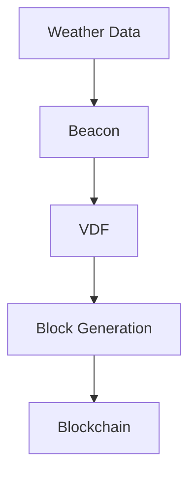

<div align="center">
    
    <h1>Btfy</h1>
    <h2>A Blockchain Secured by Weather Observations</h2>
</div>

Btfy is an experimental blockchain that explores whether weather observations can be used as a consensus beacon. By combining weather-derived beacons with Verifiable Delay Functions (VDFs), btfy investigates an alternative approach to blockchain consensus.

Bitcoin creates unpredictability through computation.

Btfy explores whether naturally occurring unpredictability already exists in the real world.

Weather is one candidate.


[](https://discord.gg/SP9N9PD3Sy)
[](LICENSE)


A Japanese article explaining Btfy can be found [here](https://zenn.dev/yuzu_mikan/articles/7e5df1520f183a).

> [!IMPORTANT]
> This project is intended for technological exploration and research. It is not intended to promote, advertise, or solicit any product, service, or investment.
> Btfy is currently a project in the technical validation phase and in active development. The API and features may change without notice.  
> Star ⭐ this repo if you find this project promising!

## 🌟 Features
- ⛅ Proof of Weather consensus
- ⚡ Energy-efficient block production using VDFs
- 🌍 Real-world entropy source from weather observations
- 🔗 Hash-chain protection against replaying historical weather data

## ⛅ Why Weather?
Traditional Proof-of-Work systems consume large amounts of electricity to create a source of unpredictability that secures consensus.

Btfy takes a different approach.

Instead of spending energy on computational puzzles, Btfy derives unpredictability from real-world weather observations. Future weather conditions cannot be predicted perfectly, making weather data a naturally occurring source of entropy.

This allows Btfy to build consensus without requiring energy-intensive mining.

## 🎯 How does it work?

A weather observation is used as a beacon.

A beacon is an externally observed value that is difficult to predict before it becomes publicly available.

In Btfy, weather measurements collected from multiple locations serve as the beacon.

The consensus process can be summarized as follows:



1. Weather observations are collected.
2. The observations are transformed into a beacon value.
3. A Verifiable Delay Function (VDF) is evaluated using the beacon.
4. The VDF output is included in a new block.
5. The block is appended to the hash chain.
6. Future blocks depend on previous blocks, preventing reuse of historical weather data.

Because future weather conditions are difficult to predict, generating future blocks ahead of time becomes difficult.

The hash chain further prevents attackers from generating alternative histories using previously observed weather values.

## 🔒 Security Considerations

Btfy is an experimental consensus mechanism and its security properties are still being evaluated.

The current design assumes:

- Weather observations are collected from multiple geographically distributed locations.
- No single observation point can fully determine the beacon.
- Future weather observations cannot be predicted with perfect accuracy.
- Historical weather observations cannot be reused because each block depends on the previous block hash.

The security of Proof of Weather relies primarily on the unpredictability of future observations and the cryptographic guarantees provided by VDFs and hash chaining.

This project should currently be considered experimental and not production-ready.

## 🚀 Quick Start
```bash
sudo apt -y install openssl
git clone https://github.com/kotagit75/btfy.git
cd btfy
chmod +x example/open-meteo.py commands/run.sh commands/btfy-cli.sh
./commands/run.sh example/open-meteo.py
```

[Detailed Installation Instructions](docs/installation.md)

### Run in Docker
```bash
git clone https://github.com/kotagit75/btfy.git
cd btfy
docker build ./ -t btfy
docker run -p 8080:8080 -p 62697:62697 -p 8000:8000 --network=host btfy:latest
```

### Usage
```bash
# run
cargo run --release

# run and mine blocks
cargo run --release -- --mining

# display help
cargo run --release -- --help

# check health
./commands/btfy-cli.sh health

# get balance
./commands/btfy-cli.sh getbalance
./commands/btfy-cli.sh getbalancebyaddress [address]

# get chain
./commands/btfy-cli.sh getchain

# send transaction
./commands/btfy-cli.sh sendtransaction [address] [amount] [fee]

# add peer
./commands/btfy-cli.sh addpeer [IP Addr]
```

> [!CAUTION]
> No Guarantee of Monetary Value The "Btfy" project is currently in its development. Any tokens (UTXOs) generated or utilized within this network are intended solely for the technical verification of the unique "Proof of Weather" consensus and overall system stability. They do not represent, nor do they guarantee, any real-world monetary value, convertibility to legal tender, or purchasing power.

## 📚 Documents
- [docs/installation.md](docs/installation.md)
- [docs/temperature_script_example.md](docs/temperature_script_example.md)
- [FAQs](docs/faq.md)

## 📍 Locations which is collected temperature data
Btfy gets temperature data from multiple locations. They are currently placed in Japan. The locations are as follows:

|Name|Latitude|Longitude|
|:-:|:-:|:-:|
|Wakkanai Airport|45.3995654|141.7974528|
|Asahikawa Airport|43.67147493|142.446865|
|Kushiro Airport|43.04503509|144.1962358|
|Obihiro Airport|42.73121032|143.2177867|
|Sapporo Okadama Airport|43.11577495|141.3802179|
|New Chitose Airport|42.77899571|141.6860269|
|Hakodate Airport|41.7754762|140.8161369|
|Aomori Airport|40.73545867|140.6902087|
|Akita Airport|39.61432074|140.2176736|
|Hanamaki Airport|39.42148821|141.1384845|
|Sendai Airport|38.13993289|140.9170924|
|Yamagata Airport|38.41209636|140.3703334|
|Fukushima Airport|37.2284081|140.4282886|
|Niigata Airport|37.95505405|139.1114496|
|Matsumoto Airport|36.16462046|137.9264258|
|Narita International Airport|35.77073692|140.3848188|
|Tokyo International Airport|35.548171|139.7791314|
|Shizuoka Airport|34.79653615|138.1853326|
|Chubu Centrair International Airport|34.85720324|136.8101604|
|Osaka Itami Airport|34.78606811|135.4381271|
|Kansai International Airport|34.43197865|135.2367959|
|Kobe Airport|34.63507139|135.2267252|
|Takamatsu Airport|34.21484194|134.0146539|
|Kochi Airport|33.5476357|133.6739953|
|Hiroshima Airport|34.43731367|132.9207516|
|Matsuyama Airport|33.8277126|132.7003022|
|Yamaguchi Ube Airport|33.93127097|131.2786026|
|Fukuoka Airport|33.58561376|130.4500511|
|Nagasaki Airport|32.91489785|129.9170527|
|Oita Airport|33.47958263|131.7362115|
|Kumamoto Airport|32.83497974|130.8588813|
|Kagoshima Airport|31.80072839|130.7202485|
|Naha Airport|26.19990739|127.6467932|


[View geojson](src/beacon/locations.geojson)


